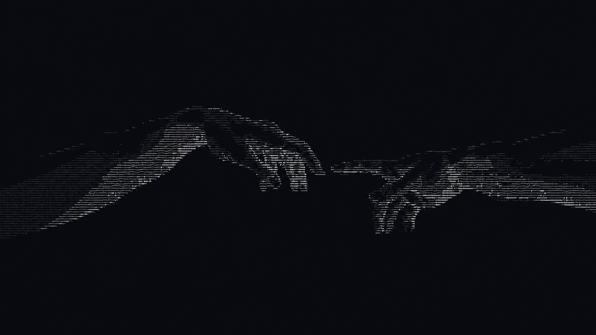

  

<h1 align="center">Welcome to Hookr4kk's Github</h1>

&lt;/&gt;

---

📌 About me

  <tr>
    <td width="70%" valign="top">
      dae eu sou o <b>Marlon</b>, e curto aprender novas tecnologias e entregar meu máximo sempre, logicamente, colocando em prática meu pequeno conhecimento em JavaScript, HTML, CSS e mais.
      <ul>
        <li>🎓 Estudando no CEDUP Renato Ramos</li>
        <li>🦅 Vai corinthians</li>
        <li>🙏🏼 God bless you</li>
      </ul>
    </td>
    

      
    

  </tr>

  
  
  
  
  
  

  

  

