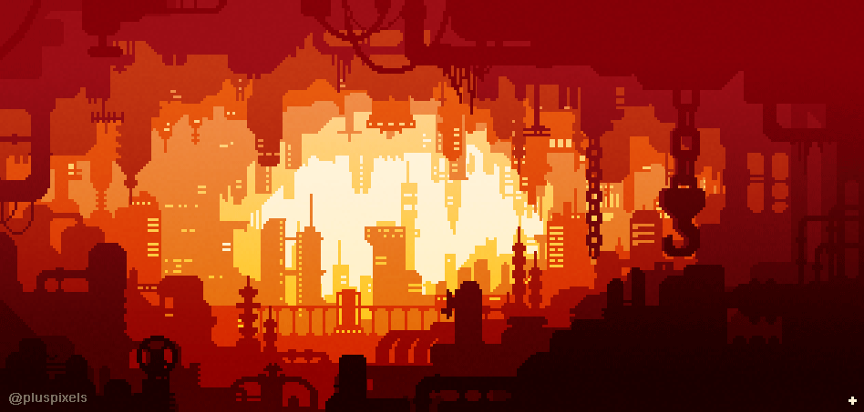

  

<h1 align="center">Welcome to Hookr4kks's Github</h1>

&lt;/&gt;

  
  
  
  
  

---

### 📌 About me

<table>
  <tr>
    <td width="70%" valign="top">
      Olá! Eu sou o <b>Hookr4kks</b>, e curto aprender novas tecnologias e resolver problemas colocando em prática pequenos e divertidos projetos usando JavaScript, HTML, CSS e mais.
      <ul>
        <li>🎓 Estudando na [SUA UNIVERSIDADE/CURSO]</li>
        <li>👨‍🏫 Tutor particular de [SUA ÁREA]</li>
        <li>🏆 Competidor em [SUA COMPETIÇÃO]</li>
        <li>♟️ Chess Player</li>
      </ul>
    </td>
    <td width="30%" align="center">
      
    </td>
  </tr>
</table>

---

### 🛠️ Technologies

  
  
  
  
  
  
  
  
  
   
  
  
  
  
  
  

---

### 📊 Statistics

  
  

  

